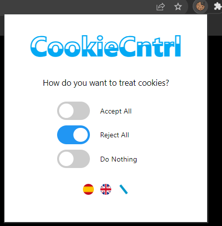

#   Cookie Control 

A Chrome extension for cookie control that allows the user to manage the use of essential and non-essential cookies by websites. Initially it is only operational for pages managed by the following CMPs:

    1. Complianz
    2. CookieNotice.
    3. CookieYes.
    4. Didomi.
    5. OneTrust.
    6. Osano
This is an open source project that provides a framework structure that allows future contributors to add new CMPs and extend the Chrome plug-in control network.
[](https://github.com/ellerbrock/open-source-badges/)


## Badges

[](https://choosealicense.com/licenses/mit/)


[](https://github.com/MirandaCarou/Cookie-Blocker-Extension/graphs/commit-activity)

[](https://github.com/MirandaCarou/AMA)

[](https://www.javascript.com/)

## Demo

https://github.com/MirandaCarou/Cookie-Blocker-Extension/assets/71145273/edbdad46-e548-4847-95f7-e2174b8cd93d

## Screenshots

 

## Deployment 👷‍♀

No prerequisites other than a text editor and **Google Chrome** are required. 

Once you have copied the repository locally (in case you just want to test it you just have to access this url -> <-) to test future changes you should: 

  1. We go to the extensions section, or we put in the address bar chrome://extensions/ and on the top right side we activate the developer mode.
  2. Then click on the unzipped load button. 📦
  3. Select the folder where we have our files.
     
  


## Documentation

[Bacherol´s Thesis](https://linktodocumentation) 👩‍🎓

[Api Google Chrome Extension](https://developer.chrome.com/docs/extensions/mv3/)

[Web Tech Survey](https://webtechsurvey.com/technology-type/cookie-compliance) 👾

[CookieYes](https://www.cookieyes.com/es/) 👻

[CookieNotice](https://wordpress.org/plugins/cookie-notice/) 👺

[Osano](https://www.osano.com/) 👹

[Complianz](https://complianz.io/) 🤖

[Onetrust](https://www.onetrust.es/) 👽

[Didomi](https://www.didomi.io/) 💀

This project has the following folder structure: 🌳🌲

```bash
  D:.
│   .gitattributes
│   CONTRIBUTING.md
│   diagram.txt
│   LICENSE.txt
│   manifest.json
│   README.md
│   SECURITY.md
│   
├───css
│       popup.css
│       
├───demos
│       2023-11-16 21-09-21.mkv
│       demo1.mp4
│       
├───html
│       popup.html
│       
├───icons
│       CapturaExrensionChrome.png
│       CapturaExtension2.png
│       cookie.png
│       cookie128.png
│       cookie16.png
│       cookie32.png
│       cookie48.png
│       españa.jpg
│       formalLogo.png
│       galicia.png
│       inglesa.jpg
│       language.png
│       
├───js
│   │   background.js
│   │   content-script.js
│   │   popup.js
│   │   setUp.js
│   │   
│   └───Handlers
│           complianz.js
│           cookieNotice.js
│           cookieYes.js
│           didomi.js
│           handler.js
│           oneTrust.js
│           osano.js
│           
└───languages
        en.json
        es.json
        gal.json
```

## Contributing

Contributions are always welcome!

See [contributing.md](https://github.com/MirandaCarou/Cookie-Blocker-Extension/blob/main/CONTRIBUTING.md) for ways to get started.

Please adhere to this project's code of conduct.


## Feedback

If you have any feedback, please reach out to me at mclainho19@esei.uvigo.es 

## Authors

- [Miranda Carou Laiño ](https://github.com/MirandaCarou)


